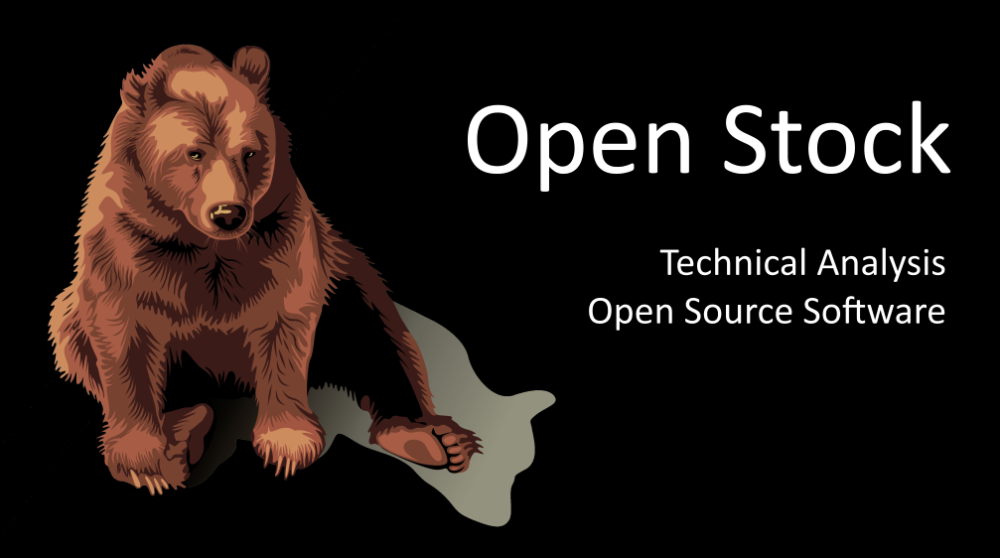
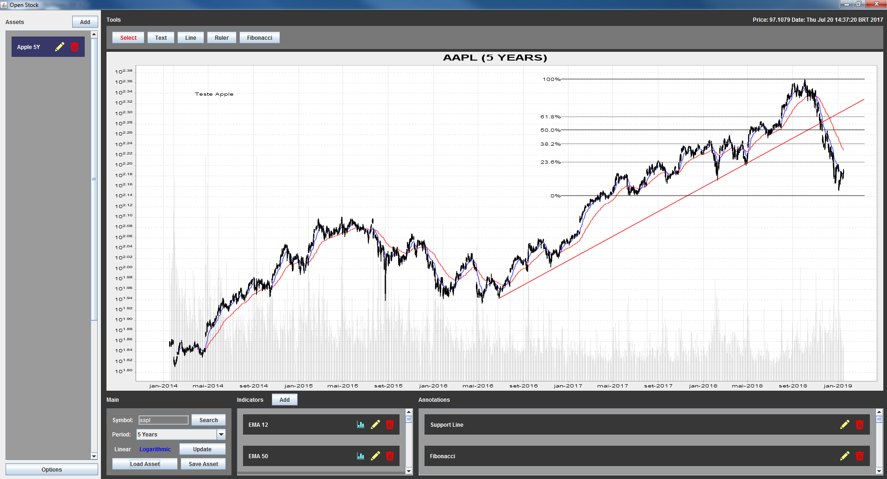

# Open Stock
Open Source Technical Analysis Software

## About
Open Stock is a project licensed under GNU GPLv3. The project is being created making use of NetBeans and Java. And some of its features include:

- [x] Real-time stocks data
- [x] Possibility to anaylise multiple charts at the same time
- [x] Use of Annotations and Indicators for Technical Analysis
- [x] To create your own Indicators to use with the software, making use of Bearcode Scripts (JavaScript files)
- [x] Save/Load charts and its TAs
- [ ] Real-time cryptocurrency and other assets data
- [ ] Offline Trading for training

This project has a similar counterpart made in C# .NET. Connected to the HitBTC Exchange, this other project presents Tickers, Orderbooks, Buy and Sell panels, simulation panels for Offline training trading and also a section to work with multiple trader bots configuring specific TA events and rules. The idea is also to use this project as reference to add new features. And this project also invites anyone interested to contribute with it.

Data provided for free by IEX. View IEX’s Terms of Use at https://iextrading.com/api-exhibit-a/.

## Usage
To test the software download the contents of https://github.com/lcmeyer37/openstock/tree/master/dist and run the .jar file.
