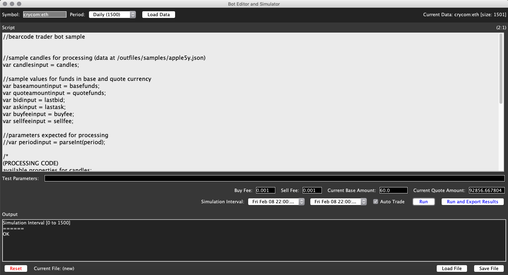
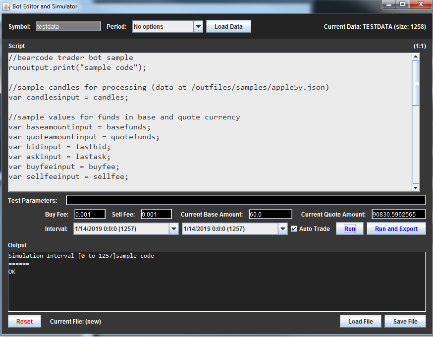

# Open Stock
Open Source Technical Analysis and Offline Trading Software

## About
Open Stock is a project [licensed under GNU GPLv3](https://github.com/lcmeyer37/openstock/blob/master/LICENSE), being created making use of NetBeans and Java. This repository is welcome to anyone interested to [contribute](CONTRIBUTING.md) with it. 

Features:
* Real-time data for multiple assets: stocks, dividends, indexes, forex, cryptocurrency
* Possibility to analyze multiple charts at the same time
* Use of Annotations and Indicators for Technical Analysis
* Use of Robots to test automatic Algorithmic Trading 
* To create your own Indicators to use with the software (Bearcode Scripts)
* To create your own Trader Bots algorithms to use with the software (Bearcode Scripts)
* To test the efficacy of algorithms with the Bots Editor and History Trading Simulator
* Save/Load Charts and Offline Transactions
* Export .csv files for spreadsheets tracking
* OHLC and Separate Indicator charts
* Offline Trading
* Telegram Bots for private notifications

Data and functionality provided for free by:
* [IEX](https://iextrading.com/api-exhibit-a/)
* [Alpha Vantage](https://www.alphavantage.co/terms_of_service/)
* [CryptoCompare](https://www.cryptocompare.com/api-licence-agreement/)
* [Telegram API](https://core.telegram.org/api/terms)

## Usage
To use the software you can download the [Current Release ZIP file](https://github.com/lcmeyer37/openstock/releases) or the latest contents of https://github.com/lcmeyer37/openstock/tree/master/dist and run the .jar file.

[Contribute with crypto](https://commerce.coinbase.com/checkout/4f5a0777-1d17-4a96-90e6-9a2d6046a08b)
