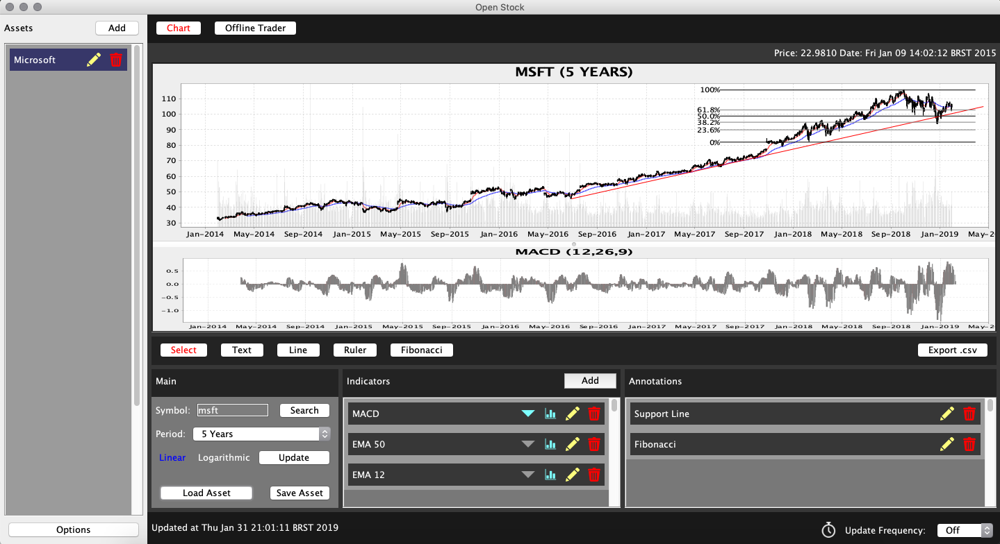
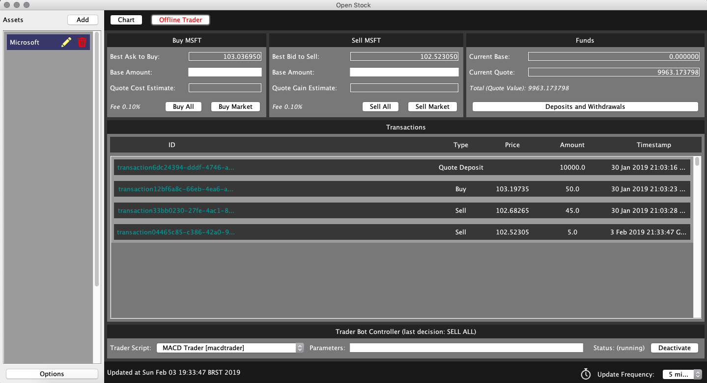

# Open Stock
Open Source Technical Analysis and Offline Trading Software

## About
Open Stock is a project [licensed under GNU GPLv3](https://github.com/lcmeyer37/openstock/blob/master/LICENSE), being created making use of NetBeans and Java. Some of its features include:

- [x] Real-time data for multiple assets: stocks, dividends, indexes, cryptocurrency
- [x] Possibility to analyze multiple charts at the same time
- [x] Use of Annotations and Indicators for Technical Analysis
- [x] Use of Robots to test automatic Algorithmic Trading 
- [x] To create your own Indicators to use with the software (Bearcode Scripts)
- [x] To create your own Trader Bots algorithms to use with the software (Bearcode Scripts)
- [x] To test the efficacy of trading algorithms with the Editor Trader and Simulator
- [x] Save/Load Charts and Offline Transactions
- [x] Export .csv files for spreadsheets tracking
- [x] OHLC and Separate Indicator charts
- [x] Offline Trading
- [x] Telegram Bots for private notifications

This project has a similar counterpart made in C# .NET. Connected to the HitBTC Exchange, this other project presents Tickers, Orderbooks, Buy and Sell panels, simulation panels for Offline training trading and also a section to work with multiple trader bots configuring specific TA events and rules. The idea is also to use this project as reference to add new features. And this project also invites anyone interested to contribute with it.

Data and functionality provided for free by:
* [IEX](https://iextrading.com/api-exhibit-a/)
* [Alpha Vantage](https://www.alphavantage.co/terms_of_service/)
* [CryptoCompare](https://www.cryptocompare.com/api-licence-agreement/)
* [Telegram API](https://core.telegram.org/api/terms)

## Usage
To use the software you can download the [Current Release ZIP file](https://github.com/lcmeyer37/openstock/releases) or the latest contents of https://github.com/lcmeyer37/openstock/tree/master/dist and run the .jar file.

[Contribute with crypto](https://commerce.coinbase.com/checkout/4f5a0777-1d17-4a96-90e6-9a2d6046a08b)
